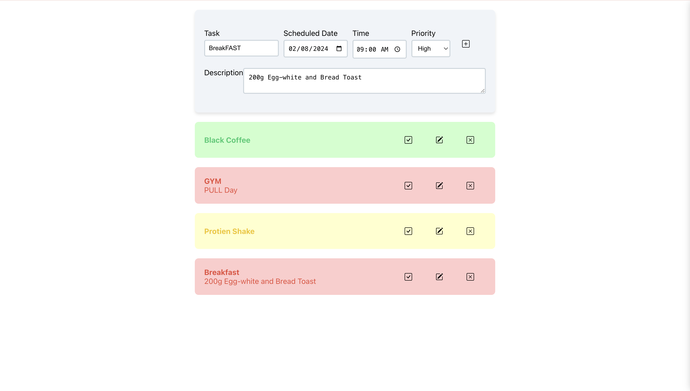

# Todo List App



## Introduction

Welcome to our Todo List App! This simple yet powerful application helps you manage your daily tasks efficiently. Whether you're organizing work assignments, personal errands, or study schedules, our app has got you covered.

## Features

- **Add Tasks**: Easily add tasks for the day, specifying priority levels and scheduled dates.
- **View Today's Tasks**: Quickly see all tasks scheduled for the current day.
- **Mark Tasks as Done**: Check off tasks as you complete them.
- **Edit and Delete Tasks**: Modify task details or remove tasks as needed.
- **Responsive Design**: Enjoy a seamless experience across devices with our responsive layout.

## Technologies Used

- **Frontend**: React.js, CSS
- **Backend**: Django, Django REST Framework
- **Database**: PostgreSQL
- **Other Tools**: Axios, Git

## Installation

### Prerequisites
- Docker and Docker Compose installed on your system.

1. Clone the repository:

    ```
    git clone https://github.com/juZnu/TODO.git
    ```

2. Navigate to the project directory:

    ```
    cd TODO
    ```

3. Start Docker Compose:

    ```
    docker-compose up
    ```

4. Once Docker Compose has finished setting up the containers, you can access the Todo List App in your web browser at `http://localhost:8080`.

### Additional Notes:

- The `docker-compose.yml` file provided in the repository sets up containers for the frontend, backend, and database services required to run the Todo List App.

- The frontend service uses React.js and is served by an Nginx server.
  
- The backend service uses Django and Django REST Framework, with a PostgreSQL database.

- Ensure that Docker and Docker Compose are properly installed and configured on your system before running the above commands.

- If you encounter any issues during the installation process, please refer to the project's documentation or raise an issue on the GitHub repository for assistance.
